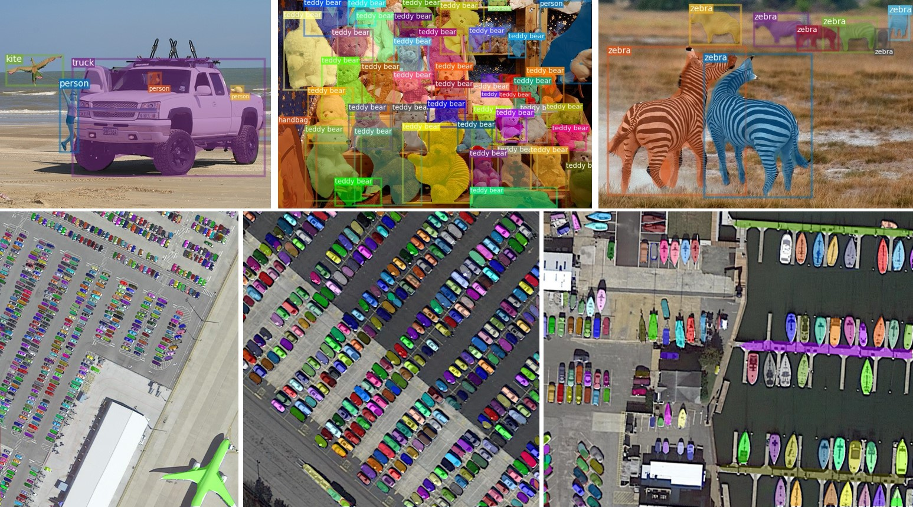
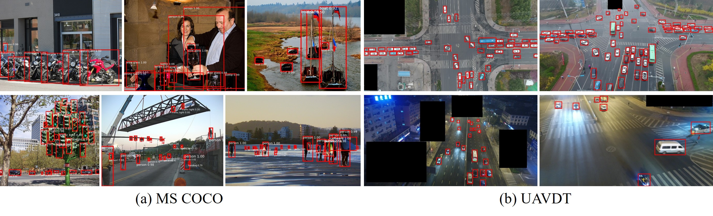

# D2Det

- This code is an official implementation of "[*D2Det: Towards High Quality Object Detection and Instance Segmentation (CVPR2020)*](https://openaccess.thecvf.com/content_CVPR_2020/papers/Cao_D2Det_Towards_High_Quality_Object_Detection_and_Instance_Segmentation_CVPR_2020_paper.pdf)" based on the open source object detection toolbox [mmdetection](https://github.com/open-mmlab/mmdetection). 
- We also provide [a new version](https://github.com/JialeCao001/D2Det-mmdet2.1) using mmdetection v2.1.0, which can further support large vocabulary datasets LVIS and Objects365.
<table>
    <tr>
        <td ><center>  </center> </td>
    </tr>    
    <tr>
        <td ><center> </center> </td>
    </tr>
</table>

## Introduction
We propose a novel two-stage detection method, D2Det, that collectively addresses both precise localization and accurate classification. For precise localization, we introduce a dense local regression that predicts multiple dense box offsets for an object proposal. Different from traditional regression and keypoint-based localization employed in two-stage detectors, our dense local regression is not limited to a quantized set of keypoints within a fixed region and has the ability to regress position-sensitive real number dense offsets, leading to more precise localization. The dense local regression is further improved by a binary overlap prediction strategy that reduces the influence of background region on the final box regression. For accurate classification, we introduce a discriminative RoI pooling scheme that samples from various sub-regions of a proposal and performs adaptive weighting to obtain discriminative features.

## Installation
- Please refer to [INSTALL.md](docs/INSTALL.md) of mmdetection. 
- I use pytorch1.1.0, cuda9.0/10.0, and mmcv0.4.3.

## Train and Inference
Please use the following commands for training and testing by single GPU or multiple GPUs.


#####  Train with a single GPU
```shell
python tools/train.py ${CONFIG_FILE}
```

#####  Train with multiple GPUs

```shell
./tools/dist_train.sh ${CONFIG_FILE} ${GPU_NUM} [optional arguments]
```
#####  Test with a single GPU

```shell
python tools/test.py ${CONFIG_FILE} ${CHECKPOINT_FILE} [--out ${RESULT_FILE}] [--eval ${EVAL_METRICS}] [--show]
```

#####  Test with multiple GPUs

```shell
./tools/dist_test.sh ${CONFIG_FILE} ${CHECKPOINT_FILE} ${GPU_NUM} [--out ${RESULT_FILE}] [--eval ${EVAL_METRICS}]
```

- CONFIG_FILE about D2Det is in [configs/D2Det](configs/D2Det), please refer to [GETTING_STARTED.md](docs/GETTING_STARTED.md) for more details.


## Demo


With our trained model, detection results of an image can be visualized using the following command.
```shell
python ./demo/D2Det_demo.py ${CONFIG_FILE} ${CHECKPOINT_FILE} ${IMAGE_FILE} [--out ${OUT_PATH}]
e.g.,
python ./demo/D2Det_demo.py ./configs/D2Det/D2Det_instance_r101_fpn_2x.py ./D2Det-instance-res101.pth ./demo/demo.jpg --out ./demo/aa.jpg
```


## Results

We provide some models with different backbones and results of object detection and instance segmentation on MS COCO benchmark.

|    name  | backbone  | iteration |  task  | validation | test-dev | download|
| :-------------: | :-----: | :-----: | :-------------------: | :-----: | :------: | :-----------------: |
|     D2Det | ResNet50   | 24 epoch  |  object detection  |   43.7 (box)  |    43.9 (box)     |          [model](https://drive.google.com/open?id=1es6y8Uu-fByOmTq_Y_M5uMuO42_ARI7k)         |
|     D2Det | ResNet101   | 24 epoch   |  object detection  |  44.9 (box)    |    45.4 (box)      |       [model](https://drive.google.com/open?id=14Cw9Y3vSdirkR3xLcb6F6H1hHr3qzLNj)         |
|     D2Det | ResNet101-DCN  | 24 epoch  |  object detection  |  46.9 (box)   |    47.5 (box)    |        [model](https://drive.google.com/open?id=1jDeAj_rMKLMf64BGwqiysis9IyZzTQ6w)         |
|     D2Det | ResNet101     | 24 epoch|  instance segmentation  |  39.8 (mask)   | 40.2 (mask)  |          [model](https://drive.google.com/open?id=1rsYWWJ7zJ7-sSWz5q6aiuGFJS5bduSDo)         |

- All the models are based on single-scale training and all the results are based on single-scale inference.

## Citation
If the project helps your research, please cite this paper.

```
@article{Cao_D2Det_CVPR_2020,
  author =       {Jiale Cao and Hisham Cholakkal and Rao Muhammad Anwer and Fahad Shahbaz Khan and Yanwei Pang and Ling Shao},
  title =        {D2Det: Towards High Quality Object Detection and Instance Segmentation},
  journal =      {Proc. IEEE Conference on Computer Vision and Pattern Recognition},
  year =         {2020}
}
```

## Acknowledgement
Many thanks to the open source codes, i.e., [mmdetection](https://github.com/open-mmlab/mmdetection) and [Grid R-CNN plus](https://github.com/STVIR/Grid-R-CNN).
